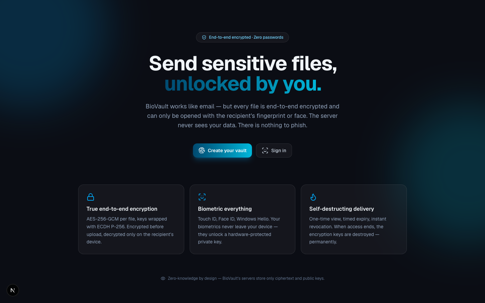
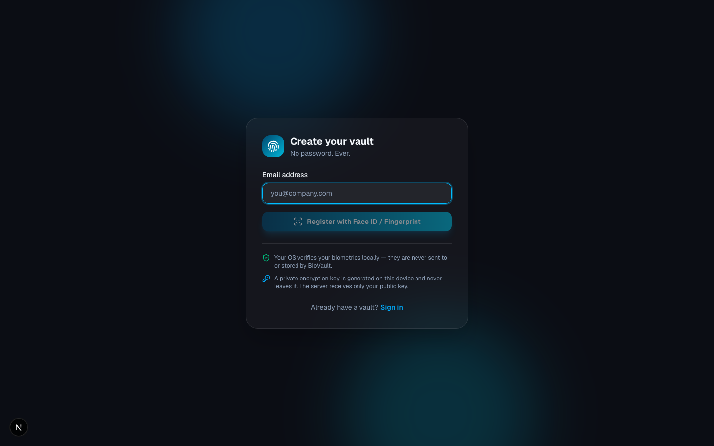
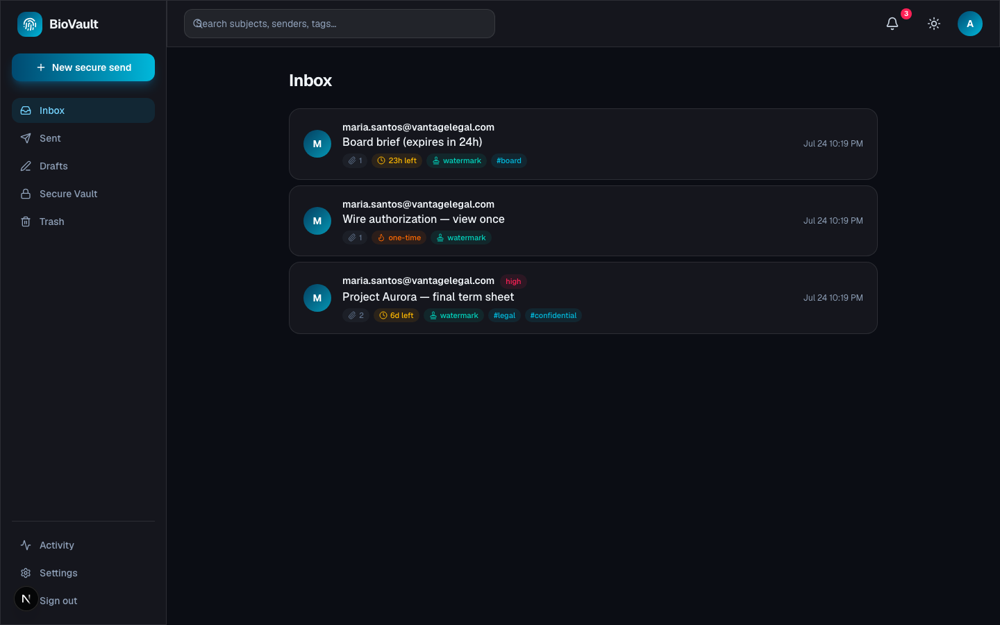
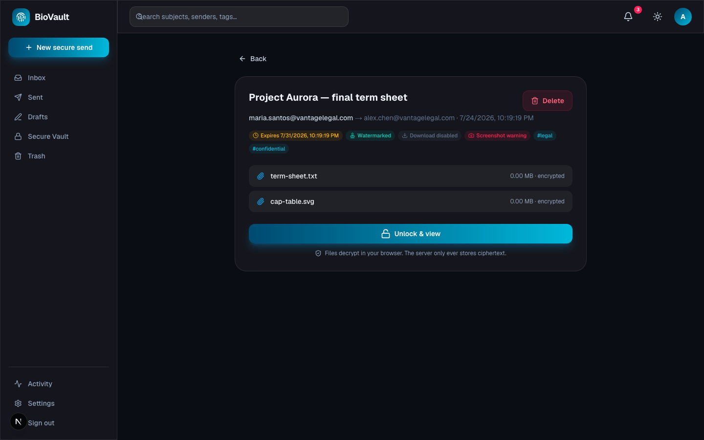
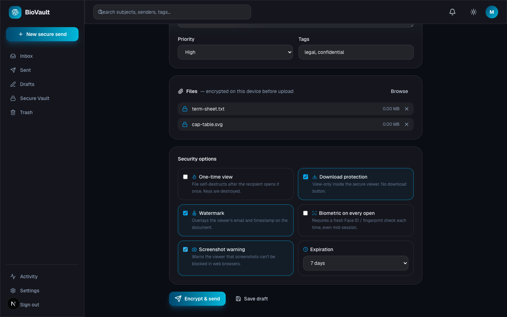
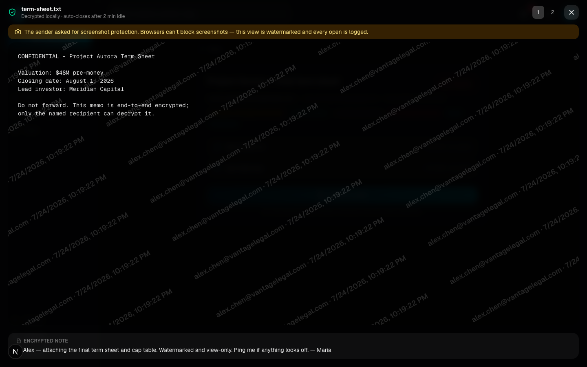
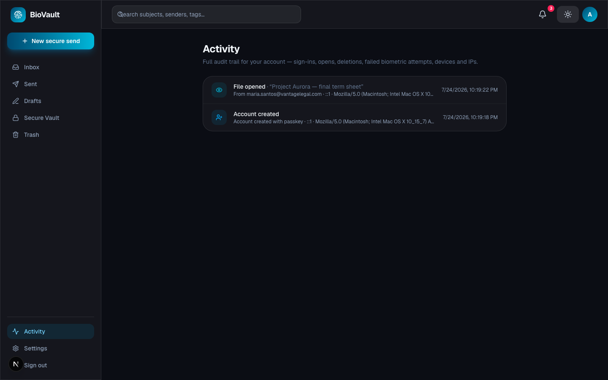
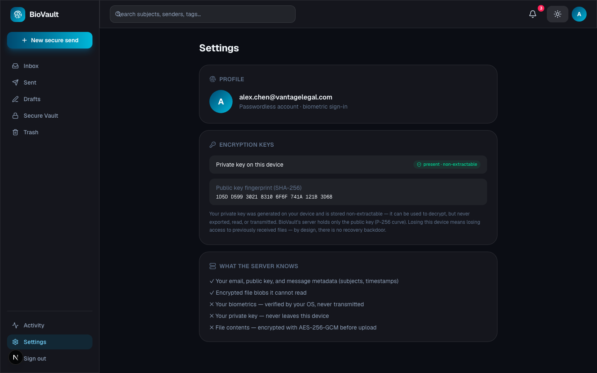

<div align="center">

# 🔐 BioVault

### Biometric, end-to-end encrypted file transfer.

**Face ID. Touch ID. Windows Hello. Zero passwords, zero servers that can read your files.**

BioVault works like email — inbox, sent, drafts, search — except every file is encrypted on your device before it ever leaves, and can only be opened by unlocking a fingerprint or face scan. There's no password to phish, no plaintext for a breach to expose. Think Gmail + Signal + Face ID, built for confidential documents.

[](#tech-stack)
[](#tech-stack)
[](#authentication--passwordless-by-construction)
[](#end-to-end-encryption)
[](#-why-biovault)
[](LICENSE)

**⭐ If this looks useful, star the repo — it genuinely helps.**

[](https://buymeacoffee.com/salahasfan)

<br/>



</div>

---

## 🧠 Why BioVault?

Every "secure" file-sharing tool still asks for a password somewhere — and passwords get phished, reused, and leaked.

- **🔒 True end-to-end encryption** — files are encrypted with AES-256-GCM on the sender's device *before* upload. The server only ever stores ciphertext and public keys; it's architecturally incapable of reading your files, even if compromised.
- **👆 Passwordless by design** — registration and sign-in run entirely through **WebAuthn passkeys**. The OS verifies your Face ID / Touch ID / Windows Hello locally; your biometric data never touches BioVault's server.
- **🔥 Self-destructing delivery** — one-time view, timed expiry, and instant sender revocation. When access ends, the encryption keys are destroyed — not just hidden, *gone*.
- **📧 Feels like email** — inbox, sent, drafts, a secure vault, search, tags, priority, notifications. No new mental model to learn.
- **🕵️ Full audit trail** — every login, open, delete, expiry, and failed biometric attempt is logged with device and IP, visible to you in-app.
- **🆓 Free & source-available** — free for any **noncommercial** use. Fork it, learn from it, adapt it.

---

## 📸 Screenshots

<div align="center">

**Passwordless registration** — no password field exists anywhere in the app


**Inbox** — security status, expiry countdowns, and tags at a glance


</div>

| Locked message detail | Compose with security controls |
|:---:|:---:|
|  |  |

| Secure viewer — watermarked, no download | Full audit trail |
|:---:|:---:|
|  |  |

| Settings — key fingerprint, zero-knowledge summary |
|:---:|
|  |

---

## ✨ What it can do

<table>
<tr>
<td width="50%" valign="top">

### 👆 Authentication
- **WebAuthn passkeys** — Face ID, Touch ID, Windows Hello, Android Biometrics
- Platform authenticator required — no security-key fallback, no password ever
- Signature-counter replay protection
- 5-strike lockout with a 15-minute cooldown on failed biometrics
- Per-open re-verification — force a *fresh* biometric check even mid-session

### 🔑 End-to-end encryption
- **ECDH P-256** identity keypair generated on-device, non-extractable
- **AES-256-GCM** random key per file, wrapped separately for sender & recipient
- Ephemeral ECDH + HKDF-SHA256 key wrapping (ECIES-style)
- Server stores ciphertext + public keys only — verified by scanning the raw DB in the test suite

### 🔥 Delivery controls
- **One-time view** — keys destroyed the instant the file is served
- **Expiration** — 1h / 6h / 24h / 7d / 30d / custom date
- **Instant revocation** — sender delete kills recipient access immediately
- **Download protection**, **watermarking**, and an honest **screenshot warning**

</td>
<td width="50%" valign="top">

### 📧 Mail client
- Inbox, Sent, Drafts, Secure Vault, Trash
- Search across subjects, senders, and tags
- Priority levels, custom tags, drag-and-drop attachments
- Local drafts, live notifications, dark & light themes

### 🖥️ Secure viewer
- Renders images, PDFs, video, audio, and text — decrypted only in memory
- Tiled watermark overlay (viewer email + timestamp)
- Auto-closes after 2 minutes idle; requires re-unlock to reopen
- Object URLs revoked the instant the viewer closes

### 🕵️ Audit & notifications
- Every login, open, delete, revoke, expiry, and failed biometric attempt is logged
- Device, IP, and timestamp on every entry
- Notified on delivery, opens, one-time completion, revocation, and new-device sign-in

</td>
</tr>
</table>

---

## 🚀 Quick Start

```bash
git clone https://github.com/Salahasfan02/Secure-Link.git
cd Secure-Link
npm install
npm run dev        # → http://localhost:3000
```

Open the app in a browser on a device with platform biometrics, click **Create your vault**, enter an email, and approve the Face ID / Touch ID / Windows Hello prompt. That's it — no password screen exists.

> 💡 **Testing on mobile Face ID?** WebAuthn requires a secure context — `localhost` counts on your own machine, but a raw LAN IP from a phone doesn't. Tunnel it: `npx cloudflared tunnel --url http://localhost:3000`, then open the generated `https://` URL on your phone.

<details>
<summary><b>Run the automated end-to-end test suite</b></summary>

```bash
node scripts/e2e-test.mjs http://localhost:3000
```

Simulates a real WebAuthn platform authenticator (genuine P-256 signatures that the server cryptographically verifies) and drives 26 checks across registration, login, one-time view, revocation, per-open biometric re-auth, expiry, trash, and a zero-knowledge scan of the raw SQLite file confirming no plaintext ever touches the server.
</details>

---

## 📋 Requirements

| | |
|---|---|
| **Node.js** | 18+ |
| **Browser** | Any modern browser with WebAuthn platform authenticator support (Chrome, Safari, Edge) |
| **Biometric hardware** | Touch ID / Face ID (Apple), Windows Hello, or Android Biometrics |

> No database server, no external services, no API keys. SQLite runs embedded; everything is local by default.

---

## 🔐 Security & Privacy

BioVault is built so the server is architecturally unable to betray you:

- **The server never sees plaintext** — files are encrypted on the sender's device before upload and decrypted only on the recipient's device. Verified in CI by scanning the raw database file for the literal plaintext.
- **Biometrics never act as key material** — Face ID / Touch ID gate access to a locally-stored private key; they are never transmitted, never stored, and never used to derive encryption keys directly.
- **No recovery backdoor** — the private key lives only on the device where the account was registered. Lose the device, lose access to previously received files. That's the tradeoff for a server that truly can't read your data.
- **Defense in depth** — rate limiting, brute-force lockouts, replay-protected signature counters, single-use re-auth tokens, and a full audit log.

See [Honest limitations](#️-honest-limitations) below for the specific tradeoffs of a web-based MVP versus a native app with hardware-backed Secure Enclave / Android Keystore.

---

## 🏗️ Tech Stack

**Frontend & Backend:** Next.js 16 (App Router) · TypeScript · Tailwind CSS 4
**Auth:** WebAuthn / Passkeys via `@simplewebauthn`
**Crypto:** Web Crypto API — ECDH P-256, AES-256-GCM, HKDF-SHA256
**Storage:** better-sqlite3 (swap for Postgres/Redis/S3 at scale — see roadmap)
**Testing:** Custom E2E suite with a hand-built WebAuthn authenticator simulator; Playwright-driven screenshot pipeline using a CDP virtual authenticator

---

## 🗺️ Roadmap

- [ ] Team workspaces & group encrypted file sharing
- [ ] Enterprise SSO (Azure AD, Okta, OIDC)
- [ ] FIDO2 hardware security keys (YubiKey)
- [ ] Digital signatures for document authenticity
- [ ] Desktop (Tauri) & mobile (React Native) shells with hardware-backed Secure Enclave / Android Keystore
- [ ] Multi-device key sync
- [ ] Redis-backed rate limiting for multi-instance deployments
- [ ] Public API & SDK

---

## ⚠️ Honest limitations

- The private key lives in the browser's IndexedDB as a non-extractable key — safe from exfiltration, but a same-origin XSS could still *use* it. Native shells should bind it to a hardware Secure Enclave / Keystore.
- Screenshot blocking is impossible on the web — BioVault warns instead of pretending. Native apps could use `FLAG_SECURE` / `isCaptured`.
- WebAuthn can't express "require both fingerprint AND face" — the OS picks the modality. Possible on native via sequential biometric policies.
- Losing your device means losing decryption ability for files already received — there's no backdoor, by design.

---

## 🤝 Contributing

PRs, ideas, and bug reports are welcome — the crypto layer, delivery controls, and mail client are all modular by design.

## ⭐ Star it

If BioVault is useful, interesting, or just a fun read through the crypto code — **drop a star**. It helps other people find it.

## ☕ Support

BioVault is free and built in spare time. If it helped you, taught you something, or you just want to fuel the next feature, you can [**buy me a coffee**](https://buymeacoffee.com/salahasfan). Thank you! 🙏

<a href="https://buymeacoffee.com/salahasfan"></a>

## 📄 License

[PolyForm Noncommercial 1.0.0](LICENSE) — **free for any noncommercial use**: personal projects, hobby, research, education, and nonprofits. Use, modify, and share it freely — just not for commercial sale. Commercial use requires a separate license from the author.

<div align="center">
<br/>
<b>Built for the idea that "secure file sharing" shouldn't require trusting anyone with a password.</b>
</div>
